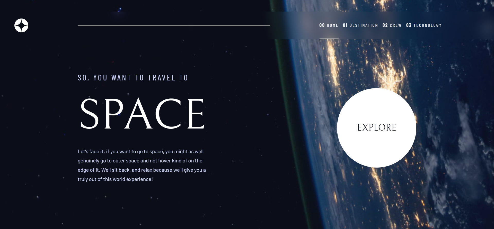
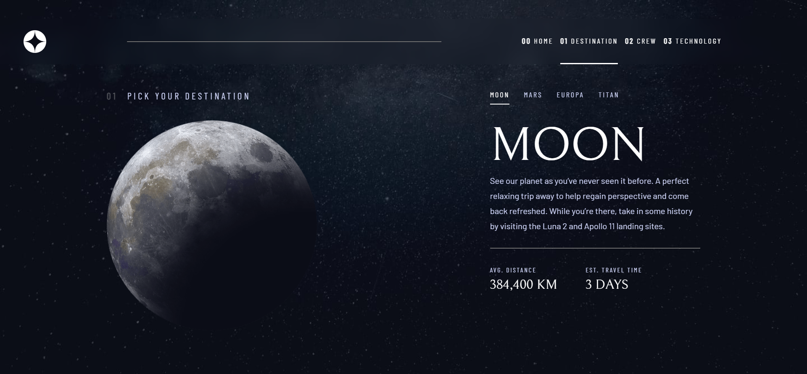
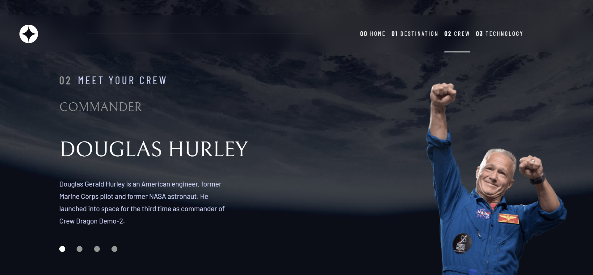
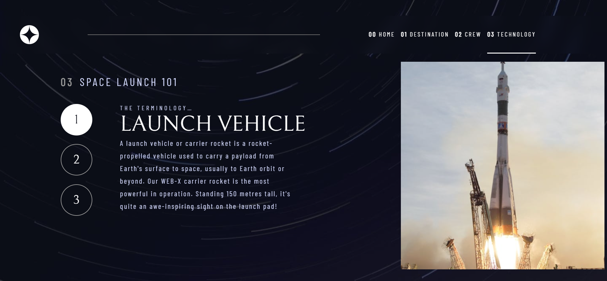
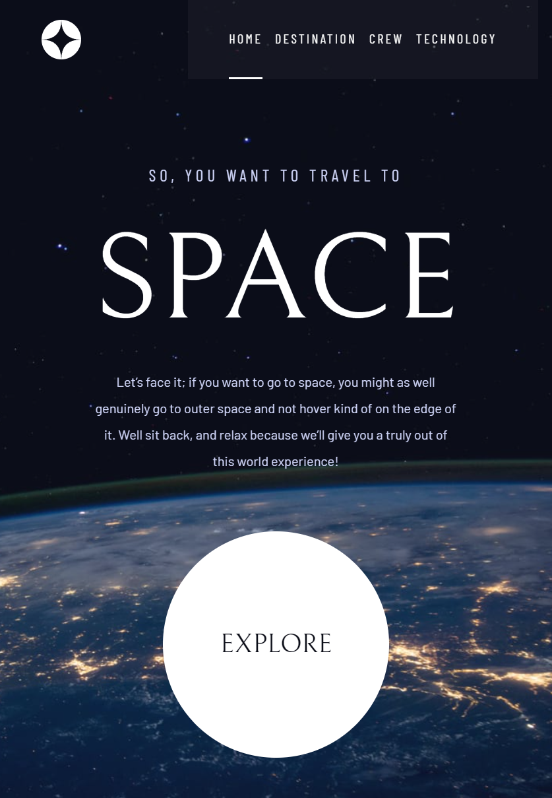
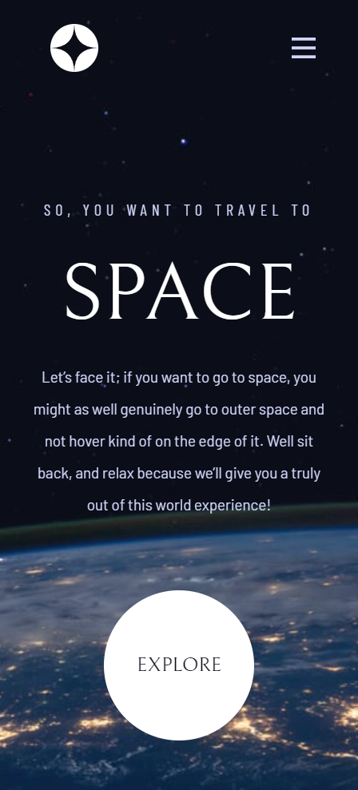
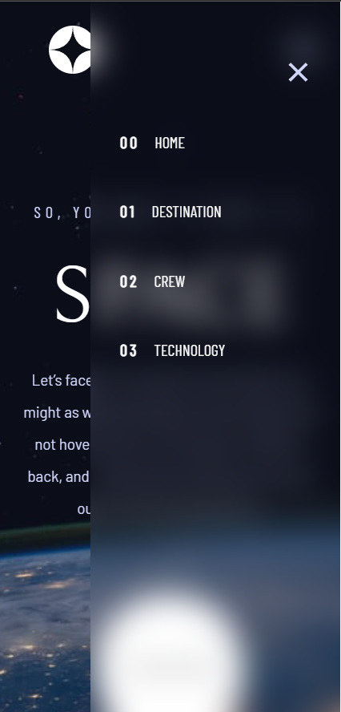

# Frontend Mentor - Space tourism website solution

This is a solution to the [Space tourism website challenge on Frontend Mentor](https://www.frontendmentor.io/challenges/space-tourism-multipage-website-gRWj1URZ3). Frontend Mentor challenges help you improve your coding skills by building realistic projects. 

## Overview

### The challenge

Users should be able to:

- View the optimal layout for each of the website's pages depending on their device's screen size
- See hover states for all interactive elements on the page
- View each page and be able to toggle between the tabs to see new information

### Screenshot

### Links

- Solution URL: [here](https://github.com/jhonatansoto45/space-website)
<!-- - Live Site URL: [here](https://ecommerce-product-page-flame.vercel.app/e-commerce/home) -->

## My process

### Built with

- Semantic HTML5 markup
- CSS custom properties
- Flexbox
- CSS Grid
- Mobile-first workflow
- [Angular](https://angular.io/) - JS Framework
### Continued development

I want to continue learning ux/ui on mobile devices. global status of a frontend application and design patterns to give robustness to a multi access system.

## Author

- Frontend Mentor - [@jhonatansoto45](https://www.frontendmentor.io/profile/jhonatansoto45)
- Twitter - [@Bautistajhonata](https://www.twitter.com/Bautistajhonata)
